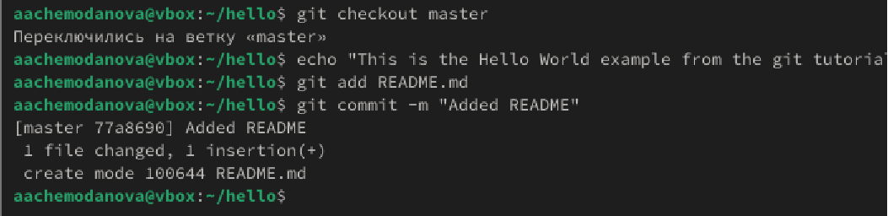

---
## Front matter
lang: ru-RU
title: Лабораторная работа №1
subtitle: "Работа с git"
author:
  - Чемоданова Ангелина Александровна
teacher:
  - Кулябов Д. С.
  - д.ф.-м.н., профессор
  - профессор кафедры теории вероятностей и кибербезопасности 
institute:
  - Российский университет дружбы народов имени Патриса Лумумбы, Москва, Россия
date: 21 февраля 2025

## i18n babel
babel-lang: russian
babel-otherlangs: english

## Formatting pdf
toc: false
toc-title: Содержание
slide_level: 2
aspectratio: 169
section-titles: true
theme: metropolis
header-includes:
 - \metroset{progressbar=frametitle,sectionpage=progressbar,numbering=fraction}
---

# Информация

## Докладчик

:::::::::::::: {.columns align=center}
::: {.column width="70%"}

  * Чемоданова Ангелина Александровна
  * Cтудентка НФИбд02-22
  * Российский университет дружбы народов имени Патриса Лумумбы
  * [1132226443@pfur.ru](mailto:1132226443@pfur.ru)
  * <https://github.com/aachemodanova>

:::
::: {.column width="30%"}

:::
::::::::::::::

## Цель работы

Приобретение практических навыков работы с ситемой управления версиями Git.

## Задание

Провести базовую настройку гит, создать проект и, используя его, изучить основные действия с репозиторием.

## Подготовка

Сначала настроим core.autocrlf с параметрами true и input, чтобы сделать все переводы строк текстовых файлов в главном репозитории одинаковыми, а затем настроим отображение unicode.

{#fig:001 width=70%}

## Создание проекта

Создадим пустой каталог hello, а в нём файл с именем hello.html. Затем создадим  git репозиторий из этого каталога, выполнив команду git init. Добавим файл в репозиторий и проверим статус, который сообщает, что коммитить нечего.

{#fig:002 width=70%}

## Внесение изменений

Изменим содержимое файла hello.html. Проверив состояние рабочего каталога увидим, что git знает, что файл hello.html был изменен, но при этом эти изменения еще не зафиксированы в репозитории. Теперь проиндексируем изменения и снова посмотрим статус, в нём указано, что изменения пока не записаны в резапозиторий. И наконец закоммитим изменения, внеся их в репозиторий и снова посмотрим статус, который теперь показывает, что все изменения внесены в репозиторий.

{#fig:003 width=30%}

## Внесение изменений

Изменим страницу «Hello, World», чтобы она содержала стандартные теги. Теперь добавим это изменение в индекс git и добавим заголовки HTML к странице «Hello, World». Проверив текущий статус увидим, что hello.html указан дважды в состоянии. Первое изменение (добавление стандартных тегов) проиндексировано и готово к коммиту. Второе изменение (добавление заголовков HTML) является непроиндексированным. Произведем коммит проиндексированного изменения, затем проиндексируем оставшееся изменение, посмотрим статус и прокоммитим его.

{#fig:004 width=40%}

## История

Посмотрим список произведённыз изменений в станлартном виде, затем в однострочном, а также с указанием времени и количества.

{#fig:005 width=40%}

## Получение старых версий

Изучим данные лога и найдем там хэш первого коммита, используя его вернемся к первой верссии и просмотрим файл hello.html, действительно, увидим первую версию. Затем вернемся к последней версии в ветке master и вновь посмотрим на файл.

{#fig:006 width=30%}

## Создание тегов версий

Назовем текущую версию страницы hello первой (v1). Создадим тег первой версии и используем его для того чтобы венуться к предыдущей, которой также присвоим тег.

{#fig:007 width=40%}

## Создание тегов версий

Переключимся по тегам между двумя отмеченными версиями. Просмотрим все доступные теги(их два) и посмотрим теки в логе.

{#fig:008 width=40%}

## Отмена локальных изменений (до индексации)

Убдеимся, что мы находимся на последнем коммите ветки master и внесем изменение в файл hello.html в виде нежелательного комментария.  Затем проверим статус, увидим, что изменения ещё не проиндексированы. Используем команду git checkout для переключения версии файла hello.html в репозитории.

{#fig:009 width=40%}

## Отмена проиндексированных изменений (перед коммитом)

Внесем изменение в файл hello.html в виде нежелательного комментария. Проиндексируем это изменение и проверим состояние. Состояние показывает, что изменение было проиндексировано и готово к коммиту. Используем команду git reset, чтобы сбросить буферную зону к HEAD. Это очищает буферную зону от изменений, которые мы только что проиндексировали. И переключимся на последнюю версию коммита, посмотрев статус увидим, что наш каталог опять чист.

{#fig:010 width=30%}

## Отмена коммитов

Изменим файл hello.html. Проиндексируем изменения файла и прокоммитим их. Чтобы отменить коммит, нам необходимо сделать коммит, который удаляет изменения, сохраненные нежелательным коммитом. Перейдем в редактор, где изменим нежелательный коммит. Проверим лог. Проверка лога показывает нежелательные и отмененные коммиты в наш репозиторий.

{#fig:011 width=40%}

## Удаление коммиттов из ветки

Удалим последние два коммита с помощью сброса, сначала отметим последний коммит тегом, чтобы его можно было потом найти. Используем команду git reset, чтобы вернуться к версии до этих коммитов. Теперь в логе их нет, но если посмотреть логи с опцией  --all можно всё ещё их увидеть, но метка HEAD находится на нужной нам версии.

{#fig:012 width=40%}

## Удаление тега oops

Удалим тег oops и коммиты, на которые он ссылался, сборщиком мусора. Теперь этот тег не отображается в репозитории.

{#fig:013 width=40%}

## Изменение предыдущего коммита

Добавим в страницу комментарий автора. Затем добавим их в репозиторий. Теперь мы хотим добавить в комментарий автора почту, обноим страницу hello, включив в неё почту. Чтобы у нас остался один коммит, а не два, изменим последний с помощью опции --amend, теперь в логах отображается последняя версия коммита.

{#fig:014 width=40%}

## Перемещение файлов

Переместим наш файл в каталог lib. Для этого создадим его и используем команду git mv, сделаем коммит этого пермещения.

{#fig:015 width=70%}

## Подробнее о структуре

Добавим файл index.html в наш репозиторий. Сделаем коммит.

{#fig:016 width=70%}

## Подробнее о структуре

Теперь при открытии index.html, увидим кусок страницы hello в маленьком окошке.

{#fig:017 width=70%}

## Git внутри: Каталог .git

Просмотрим каталог, в котором хранится вся информация git. Затем посмотрим набор каталогов, имена которых состоят из 2 символов. Имена каталогов являются первыми двумя буквами хэша sha1 объекта, хранящегося в git. Посмотрим в один из каталогов с именем из 2 букв. Увидим файлы с именами из 38 символов. Это файлы, содержащие объекты, хранящиеся в git. Посмотрим файл конфигурации, создающийся для каждого конкретного проекта. Затем посмотрим подкаталоги .git/refs/heads и .git/refs/tags, а также содержимое файла v1, в нём хранится хэш коммита, привязанный к тегу. Также посмотрим содержимоей файла HEAD, который содержит ссылку на текущую ветку, в данный момент это ветка master.

{#fig:018 width=40%}

## Работа непосредственно с объектами git

Найдем последний коммит и выедем его с помощью  SHA1 хэша. Затем посмотрим дерево каталогов, ссылка на который идёт в последнем коммите, вывдем каталог lib и файл  hello.html.

{#fig:019 width=40%}

## Работа непосредственно с объектами git

Исследуем  git репозиторий вручную самостоятельно. Используя хэш родительского коммита последовательно дойдем до первой версии файла hello.html и посмотрим его.

{#fig:020 width=70%}

## Создание ветки

Создадим новую ветку «style» и перейдем в неё. Добавим туда файл стилей style.css и добавим его в репозиторий. Обновим файл hello.html, чтобы использовать стили style.css и index.html, также обавим их в репозиторий.

{#fig:021 width=40%}

## Навигация по веткам

Посмотрим все логи.

{#fig:022 width=40%}

## Навигация по веткам

Переключимся обратно на основную ветку и просмотрим содержимое файла lib/hello.html, заметим, что он не использует стили, также просмотрим содержимое этого файла в новой ветке.

{#fig:023 width=40%}

## Изменения в ветке master

Вернемся в основную ветку и добавим файл  README.md. Просмотрим ветки и их различия.

{#fig:024 width=70%}

## Изменения в ветке master

{#fig:025 width=50%}

## Слияние

Слияние переносит изменения из двух веток в одну. Вернемся к ветке style и сольем master со style.

{#fig:026 width=35%}

## Создание конфликта

Вернемся в ветку master и создадим конфликт, внеся изменения в файл hello.html. Просмотрим ветки. После коммита ветка master была объединена с веткой style, но в настоящее время в master есть дополнительный коммит, который не был слит с style. Последнее изменение в master конфликтует с некоторыми изменениями в style.

{#fig:027 width=40%}

## Разрешение конфликтов

Вернемся к ветке style и попытаемся объединить ее с новой веткой
master. В файле lib/hello.html можно увидеть записи с обеих версий этого файла. Первый раздел — версия текущей ветки (style). Второй раздел — версия ветки master.  Внесем изменения в lib/hello.html, оставив только необходимую нам запись и добавим этот файл в репозиторий, чтобы вручную разрешить конфликт.

{#fig:028 width=40%}

## Сброс ветки style

Вернемся на ветке style к точке перед тем, как мы слили ее с веткой master. Мы хотим вернуться в ветке style в точку перед слиянием с master. Нам необходимо найти последний коммит перед слиянием.

{#fig:029 width=40%}

## Сброс ветки style

Мы видим, что коммит «Updated index.html» был последним на ветке style перед слиянием. Сбросим ветку style к этому коммиту.

{#fig:030 width=35%}

Поищим лог ветки style. Увидим, что у нас в истории больше нет коммитов слияний.

## Сброс ветки master

Добавив интерактивный режим в ветку master, мы внесли изменения, конфликтующие с изменениями в ветке style. Давайте вернемся в ветке master в точку перед внесением конфликтующих изменений. Это позволяет нам продемонстрировать работу команды git rebase, не беспокоясь о конфликтах. Просмотрим коммиты ветки master.

{#fig:033 width=40%}

## Сброс ветки master

Коммит «Added README» идет непосредственно перед коммитом конфликтующего интерактивного режима. Мы сбросим ветку master к коммиту «Added README».

{#fig:032 width=30%}

## Перебазирование

Используем команду rebase вместо команды merge. Мы вернулись в точку до первого слияния и хотим перенести изменения из ветки master в нашу ветку style. На этот раз для переноса изменений из ветки master мы будем использовать команду git rebase вместо слияния.

{#fig:033 width=40%}

## Слияние в ветку master
 
Вернемся в ветку master и сольем ветку style в неё с помощью команды git merge.

{#fig:034 width=40%}

## Клонирование репозиториев

Перейдем в наш рабочий каталог и сделаем клон репозитория hello, затем создадим клон репозитория. Просмотрев его увидим список всех файлов на верхнем уровне оригинального репозитория README.md, index.html и lib. Затем просмотрим историю репозитория и увидим список всех коммитов в новый репозиторий, и он совпадает с историей коммитов в оригинальном репозитории. Единствен в названиях веток.

{#fig:035 width=40%}

## Что такое origin?

Клонированный репозиторий знает об имени по умолчанию удаленного репозитория. Посмотрим, подробную информацию об имени по умолчанию.Для того, чтобы увидеть все ветки используем опцию -a.

{#fig:036 width=70%}

## Удаленные ветки

Посмотрим на ветки, доступные в нашем клонированном репозитории. Можно увидеть, что в списке только ветка master.

{#fig:037 width=70%}

## Изменение оригинального репозитория

Перейдем в репозиторий hello. Внесем изменения в файл README.md. Затем добавим их в репозиторий.

{#fig:038 width=40%}

## Изменение оригинального репозитория

Перейдём в клон репозитория и используем команду git fetch, которая будет извлекать новые коммиты из удаленного репозитория, но не будет сливать их с наработками в локальных ветках.

{#fig:039 width=70%}

## Слияние извлеченных изменений

Сольем внесённые изменения в главную ветку. Также можно было бы использовать команду git pull, которая является объединением fetch и merge в одну команду.

{#fig:040 width=70%}

## Добавление ветки наблюдения

Добавим локальную ветку, которая отслеживает удаленную ветку, теперь мы можем видеть ветку style в списке веток и логе.

{#fig:041 width=40%}

## Создание чистого репозитория

Как правило, репозитории, оканчивающиеся на .git являются чистыми репозиториями. Создадим такой в рабочем каталоге. Затем добавим репозиторий  hello.git к нашему оригинальному репозиторию.

{#fig:042 width=70%}

## Отправка и извлечение изменений 

Так как чистые репозитории, как правило, расшариваются на каком-нибудь сетевом сервере, нам необходимо отправить наши изменения в другие репозитории. Начнем с создания изменения для отправки. Отредактируем файл README.md и сделаем коммит, затем отправим изменения в общий репозиторий. Затем извлечем изменения из общего репозитория.

{#fig:043 width=40%}

## Выводы

В результаты выполнение лабораторной работы были приобретены практические навыки работы с ситемой управления версиями Git.
