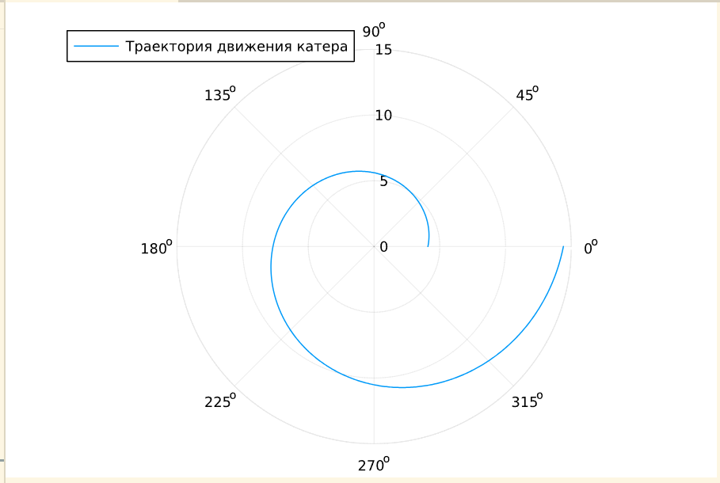
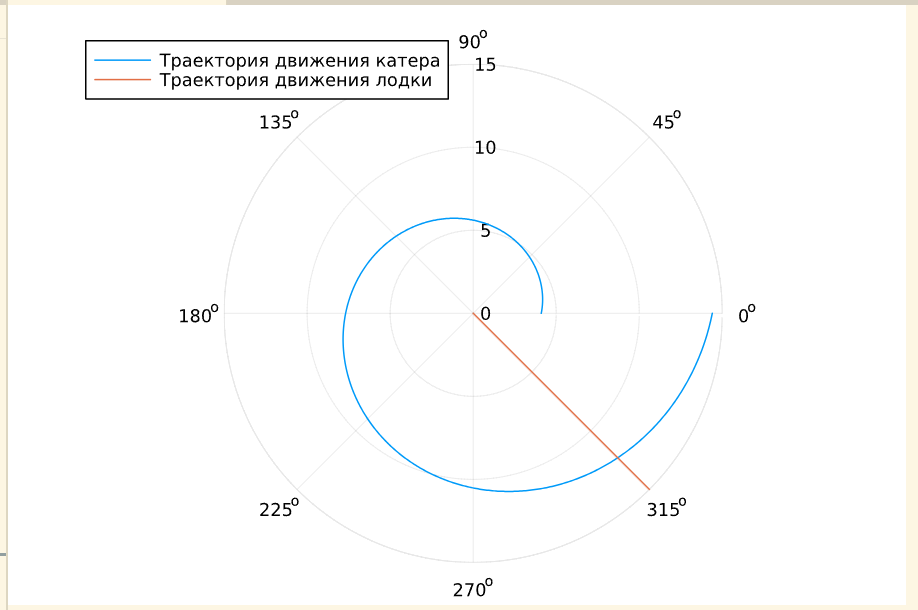
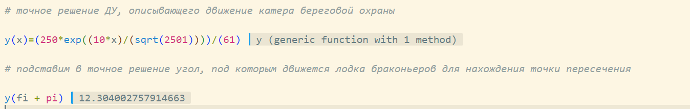
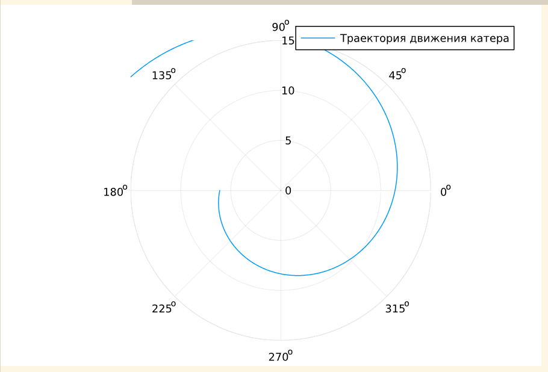
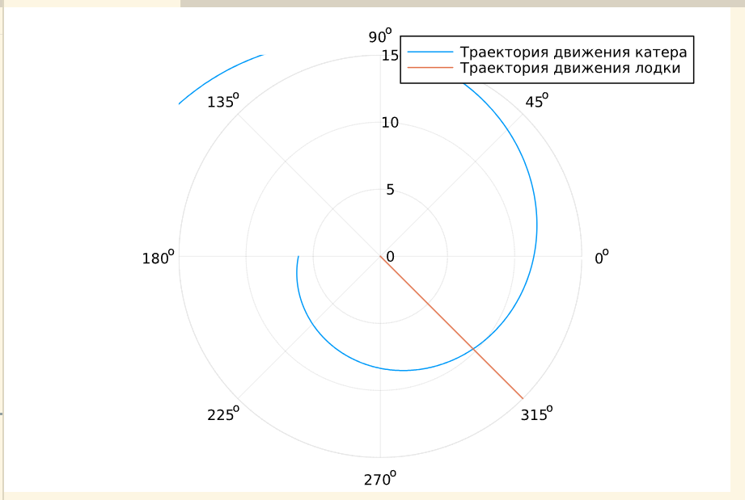
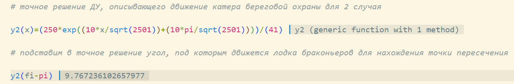

---
## Front matter
lang: ru-RU
title: Лабораторная работа №2
subtitle: "Задача о погоне"
author:
  - Чемоданова Ангелина Александровна
teacher:
  - Кулябов Д. С.
  - д.ф.-м.н., профессор
  - профессор кафедры теории вероятностей и кибербезопасности 
institute:
  - Российский университет дружбы народов имени Патриса Лумумбы, Москва, Россия
date: 26 февраля 2025

## i18n babel
babel-lang: russian
babel-otherlangs: english

## Formatting pdf
toc: false
toc-title: Содержание
slide_level: 2
aspectratio: 169
section-titles: true
theme: metropolis
header-includes:
 - \metroset{progressbar=frametitle,sectionpage=progressbar,numbering=fraction}
---

## Докладчик

:::::::::::::: {.columns align=center}
::: {.column width="70%"}

  * Чемоданова Ангелина Александровна
  * Cтудентка НФИбд02-22
  * Российский университет дружбы народов имени Патриса Лумумбы
  * [1132226443@pfur.ru](mailto:1132226443@pfur.ru)
  * <https://github.com/aachemodanova>

:::
::: {.column width="30%"}


:::
::::::::::::::

## Цель работы

Построить математическую модель для выбора правильной стратегии при решении примера задаче о погоне.

## Задание

На море в тумане катер береговой охраны преследует лодку браконьеров. Через определенный промежуток времени туман рассеивается, и лодка обнаруживается на расстоянии 25 км от катера. Затем лодка снова скрывается в тумане и уходит прямолинейно в неизвестном направлении. Известно, что скорость катера в 5,1 раза больше скорости браконьерской лодки.

## Задание

1. Записать уравнение, описывающее движение катера, с начальными условиями для двух случаев (в зависимости от расположения катера относительно лодки в начальный момент времени).

2. Построить траекторию движения катера и лодки для двух случаев.

3. Найти точку пересечения траектории катера и лодки 

## Выполнение лабораторной работы

Чтобы найти расстояние $x$ (расстояние после которого катер начнет двигаться вокруг полюса), необходимо составить простое уравнение. Пусть через время $t$ катер и лодка окажутся на одном расстоянии от полюса. За это время лодка пройдет $x$ , а катер $k-x$ (или $k+x$, в зависимости от начального положения катера относительно полюса). Время, за которое они пройдут это расстояние, вычисляется как $\dfrac{x}{v}$ или $\dfrac{k-x}{5.1v}$ (во втором случае $\dfrac{k+x}{5.1v}$). Так как время одно и то же, то эти величины одинаковы. Тогда неизвестное расстояние можно найти из следующего уравнения:
$$
\dfrac{x}{v} = \dfrac{k-x}{5.1v} \text{ -- в первом случае}
$$
$$
\dfrac{x}{v} = \dfrac{k+x}{5.1v} \text{ -- во втором}
$$
Отсюда мы найдем два значения $x_1 = \dfrac{25}{6,1}$ и $x_2 = \dfrac{25}{4,1}$, задачу будем решать для двух случаев.

## Выполнение лабораторной работы

После того, как катер береговой охраны окажется на одном расстоянии от полюса, что и лодка, он должен сменить прямолинейную траекторию и начать двигаться вокруг полюса,  удаляясь от него со скоростью лодки $v$. Для этого скорость катера раскладываем на две составляющие: $v_{r}$ - радиальная скорость и  - $v_{\tau}$ тангенциальная скорость. Радиальная скорость - это скорость, с которой катер удаляется от полюса, $v_r = \dfrac{dr}{dt}$. Нам нужно, чтобы эта скорость была равна скорости лодки, поэтому полагаем $\dfrac{dr}{dt} = v$.

Тангенциальная скорость – это линейная скорость вращения катера относительно полюса. Она равна произведению угловой скорости $\dfrac{d \theta}{dt}$ на радиус $r$, $r \dfrac{d \theta}{dt}$.

Получаем: 

$$v_{\tau} = \sqrt{26.01v^2-v^2} = \sqrt{25.01}v$$

## Выполнение лабораторной работы

Из чего можно вывести:

$$
r\dfrac{d \theta}{dt} = \sqrt{25.01}v
$$

Решение исходной задачи сводится к решению системы из двух дифференциальных уравнений:

$$\begin{cases}
&\dfrac{dr}{dt} = v\\
&r\dfrac{d \theta}{dt} = \sqrt{25.01}v
\end{cases}$$

## Выполнение лабораторной работы

С начальными условиями для первого случая:

$$\begin{cases}
&{\theta}_0 = 0\\  \tag{1}
&r_0 = \dfrac{25}{6.1}
\end{cases}$$

Или для второго:

$$\begin{cases}
&{\theta}_0 = -\pi\\  \tag{2}
&r_0 = \dfrac{25}{4.1}
\end{cases}$$

## Выполнение лабораторной работы

Исключая из полученной системы производную по $t$, можно перейти к следующему уравнению:
$$
\dfrac{dr}{d \theta} = \dfrac{r}{\sqrt{25.01}}
$$

Начальные условия остаются прежними. Решив это уравнение, мы получим траекторию движения катера в полярных координатах.

## Построение модели

```Julia
using DifferentialEquations, Plots

# расстояние от лодки до катера
k = 25

# начальные условия для 1 и 2 случаев
r0 = k/6.1
r0_2 = k/4.1
theta0 = (0.0, 2*pi) 
theta0_2 = (-pi, pi)

# данные для движения лодки браконьеров
fi = 3*pi/4;
t = (0, 50);
```

## Выполнение лабораторной работы

```Julia
# функция, описывающая движение лодки браконьеров
x(t) = tan(fi)*t;

# функция, описывающая движение катера береговой охраны
f(r, p, t) = r/sqrt(25.01)

# постановка проблемы и решение ДУ для 1 случая
prob = ODEProblem(f, r0, theta0)

sol = solve(prob, saveat = 0.01)

# отрисовка траектории движения катера
plot(sol.t, sol.u, proj=:polar, lims=(0, 15), label = "Траектория движения катера")
```

## Выполнение лабораторной работы

Получим график движения катера в 1 случае:

{#fig:001 width=40%}

## Выполнение лабораторной работы

Добавим в код:

```Julia
## необходимые действия для построения траектории движения лодки

ugol = [fi for i in range(0,15)]

x_lims = [x(i) for i in range(0,15)]

# отрисовка траектории движения лодки вместе с катером

plot!(ugol, x_lims, proj=:polar, lims=(0, 15), label = "Траектория движения лодки")
```

## Выполнение лабораторной работы

Получим график движения катера и траекторию движения лодки в 1 случае:

{#fig:002 width=40%}

## Выполнение лабораторной работы

Теперь рассчитаем точку пересечения траектории катера и лодки.

```Julia
# точное решение ДУ, описывающего движение катера береговой охраны

y(x)=(250*exp((10*x)/(sqrt(2501))))/(61)

# подставим в точное решение угол, под которым движется лодка браконьеров для нахождения точки пересечения

y(fi + pi)
```

Получим следующее значение: $12.304002757914663$. 

## Выполнение лабораторной работы

При оценки точки на глаз можно получить похожее значение:

{#fig:003 width=70%}

## Выполнение лабораторной работы

Перейдем к решению второго случая. 

```Julia
# постановка проблемы и решение ДУ для 2 случая

prob_2 = ODEProblem(f, r0_2, theta0_2)

sol_2 = solve(prob_2, saveat = 0.01)

# отрисовка траектории движения катера

plot(sol_2.t, sol_2.u, proj=:polar, lims=(0,15), label = "Траектория движения катера")
```

## Выполнение лабораторной работы

Получим график движения катера во 2 случае:

{#fig:004 width=40%}

## Выполнение лабораторной работы

Добавим в код:

```Julia
# отрисовка траектории движения лодки вместе с катером

plot!(ugol, x_lims, proj=:polar, lims=(0, 15), label = "Траекория движения лодки")
```

## Выполнение лабораторной работы

Получим график движения катера и траекторию движения лодки во 2 случае:

{#fig:005 width=40%}

## Выполнение лабораторной работы

Теперь рассчитаем точку пересечения траектории катера и лодки.

```Julia
# точное решение ДУ, описывающего движение катера береговой охраны для 2 случая

y2(x)=(250*exp((10*x/sqrt(2501))+(10*pi/sqrt(2501))))/(41)

# подставим в точное решение угол, под которым движется лодка браконьеров для нахождения точки пересечения

y2(fi-pi)
```

## Выполнение лабораторной работы

Получим следующее значение: $9.767236102657977$. При оценки точки на глаз можно получить похожее значение:

{#fig:006 width=70%}


## Выводы

Мы построили математическую модель для выбора правильной стратегии при решении примера задаче о погоне.
