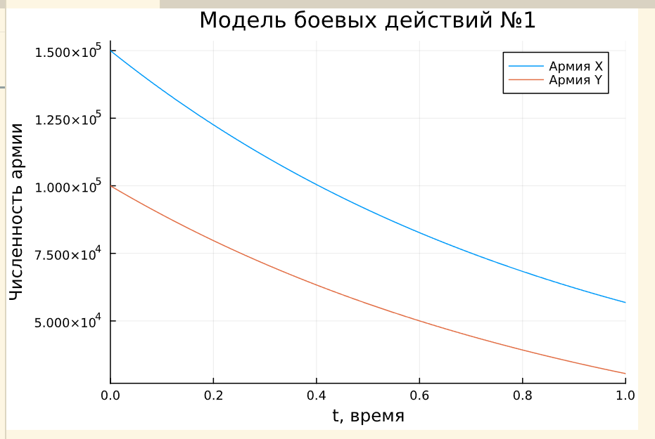
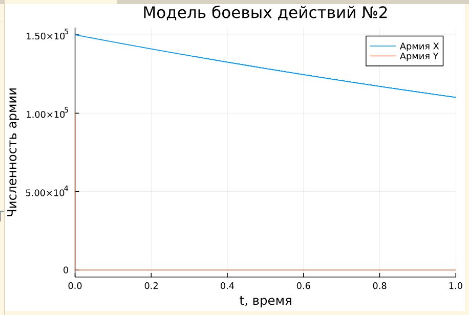
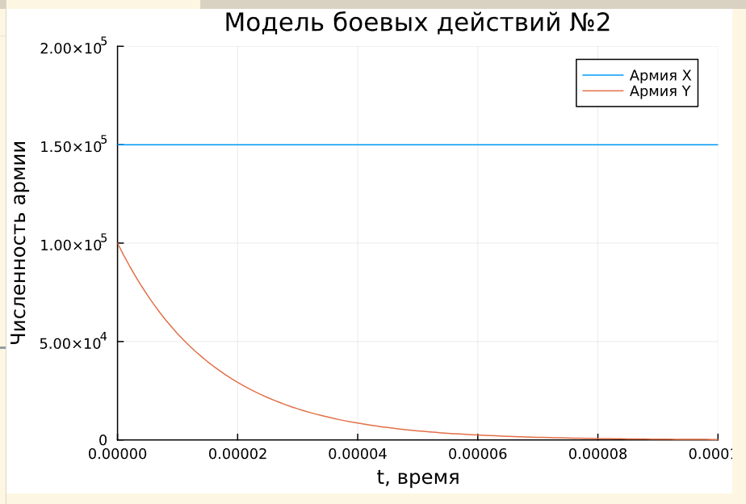
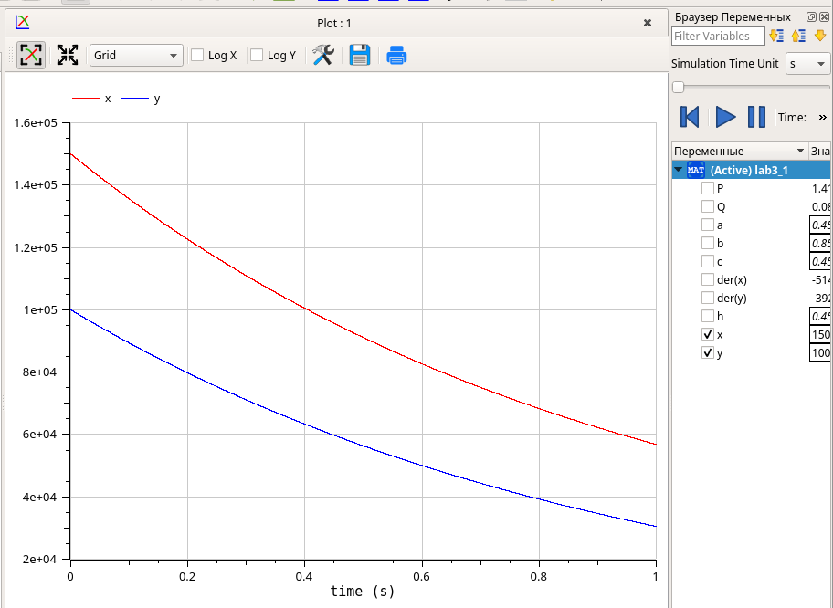
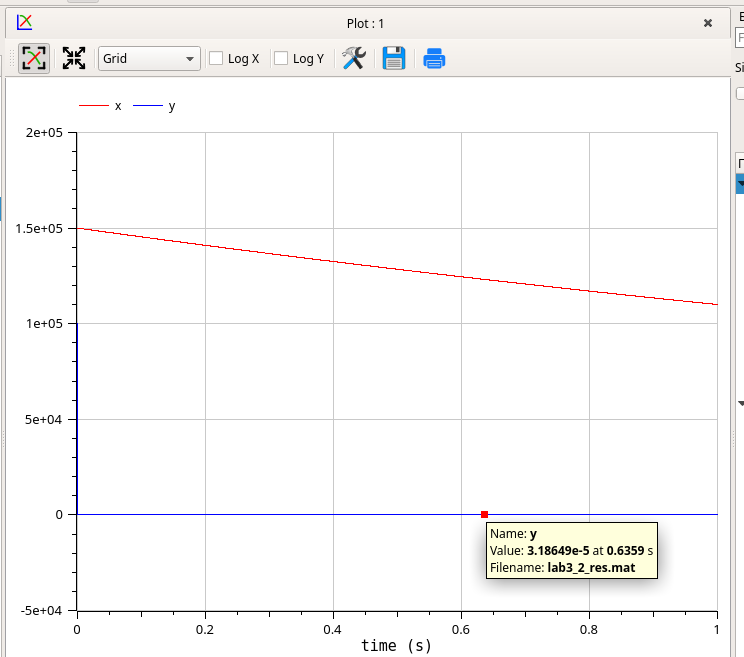
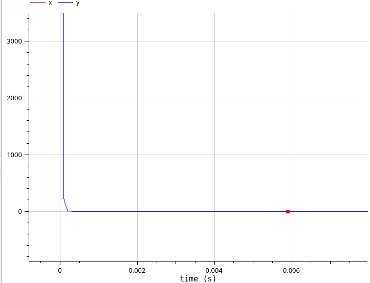

---
## Front matter
lang: ru-RU
title: Лабораторная работа №3
subtitle: Модель боевых действий
author:
  - Чемоданова Ангелина Александровна
teacher:
  - Кулябов Д. С.
  - д.ф.-м.н., профессор
  - профессор кафедры теории вероятностей и кибербезопасности 
institute:
  - Российский университет дружбы народов имени Патриса Лумумбы, Москва, Россия
date: 21 марта 2025

## i18n babel
babel-lang: russian
babel-otherlangs: english

## Formatting pdf
toc: false
toc-title: Содержание
slide_level: 2
aspectratio: 169
section-titles: true
theme: metropolis
header-includes:
 - \metroset{progressbar=frametitle,sectionpage=progressbar,numbering=fraction}
---

## Докладчик

:::::::::::::: {.columns align=center}
::: {.column width="70%"}

  * Чемоданова Ангелина Александровна
  * Cтудентка НФИбд02-22
  * Российский университет дружбы народов имени Патриса Лумумбы
  * [1132226443@pfur.ru](mailto:1132226443@pfur.ru)
  * <https://github.com/aachemodanova>

:::
::: {.column width="30%"}


:::
::::::::::::::

## Цель работы

Цель данной лабораторной работы - построить математическую модель боевых действий и провести анализ.

## Задание. Вариант 34

Между страной $X$ и страной $Y$ идет война. Численность состава войск исчисляется от начала войны, и являются временными функциями $x(t)$ и $y(t)$. В начальный момент времени страна $X$ имеет армию численностью 150 000 человек, а в распоряжении страны $Y$ армия численностью в  100 000 человек. Для упрощения модели считаем, что коэффициенты $a$, $b$, $c$, $h$ постоянны. Также считаем $P(t)$ и $Q(t)$, учитывающие возможность подкрепления к войскам в течение одного дня, непрерывными функциями.

Построить графики изменения численности войск армии $X$ и армии $Y$ для следующих случаев:

## Задание. Вариант 34

1. Модель боевых действий между регулярными войсками

$$
\begin{cases}
\dfrac{dx}{dt} = -0,45 x(t)- 0,85y(t) + \sin(t + 8) + 1\\
\dfrac{dy}{dt} = -0,45 x(t)- 0,45y(t) + \cos(t + 8) + 1
\end{cases}
$$

## Задание. Вариант 34

2. Модель ведения боевых действий с участием регулярных войск и партизанских отрядов 

$$
\begin{cases}
\dfrac{dx}{dt} = -0,31 x(t)- 0,79 y(t) + 2\sin(t) \\
\dfrac{dy}{dt} = -0,41 x(t) y(t)- 0,32 y(t) + 2\cos(t)
\end{cases}
$$

# Выполнение лабораторной работы

## Реализация в Julia. Модель боевых действий между регулярными войсками

```Julia
using DifferentialEquations, Plots
x0 = 150000
y0 = 100000
p1 = [0.45, 0.85, 0.45, 0.45]
tspan = (0,1) #интервал времени от 0 до 1
```

## Реализация в Julia. Модель боевых действий между регулярными войсками

```Julia
function f1(u,p,t)
 x,y = u
 a,b,c,h = p
 dx = -a*x-b*y + sin(t + 8) + 1
 dy = -c*x-h*y + cos(t + 8) + 1
 return [dx, dy]
end

prob1 = ODEProblem(f1, [x0,y0], tspan, p1)
solution1 = solve(prob1, Tsit5())
plot(solution1, title = "Модель боевых действий №1", 
label = ["Армия X" "Армия Y"], xaxis = "t, время", 
yaxis = "Численность армии")
```

## Реализация в Julia. Модель боевых действий между регулярными войсками

{#fig:001 width=70%}


## Реализация в Julia. Модель боевых действий с участием регулярных войск и партизанских отрядов

```Julia
p2 = [0.31, 0.79, 0.41, 0.32]

function f2(u,p,t)
 x,y = u
 a,b,c,h = p
 dx = -a*x-b*y + 2*sin(t)
 dy = -c*x*y-h*y + 2*cos(t)
 return [dx, dy]
end
```

## Реализация в Julia. Модель боевых действий с участием регулярных войск и партизанских отрядов

```Julia
prob2 = ODEProblem(f2, [x0,y0], tspan, p2)
solution2 = solve(prob2, Tsit5(), saveat=0.000001)
plot(solution2, title = "Модель боевых действий №2", 
label = ["Армия X" "Армия Y"], xaxis = "t, время", 
yaxis = "Численность армии")
```

## Реализация в Julia. Модель боевых действий с участием регулярных войск и партизанских отрядов

{#fig:002 width=50%}

## Реализация в Julia. Модель боевых действий с участием регулярных войск и партизанских отрядов

```Julia
plot(solution2, title = "Модель боевых действий №2", 
label = ["Армия X" "Армия Y"],
    xaxis = "t, время", yaxis = "Численность армии", 
    xlimit=[0, 0.0001], ylimit=[0, 200000])
```

## Реализация в Julia. Модель боевых действий с участием регулярных войск и партизанских отрядов

{#fig:003 width=50%}

## Реализация в OpenModelica.  Модель боевых действий между регулярными войсками

```Modelica
model lab3_1

Real x(start=150000);
Real y(start=100000);
Real P;
Real Q;

parameter Real a=0.45;
parameter Real b=0.85;
parameter Real c=0.45;
parameter Real h=0.45;
```

## Реализация в OpenModelica.  Модель боевых действий между регулярными войсками

```Modelica
equation
  der(x) = -a*x-b*y + P;
  der(y) = -c*x-h*y + Q;
  P = sin(time + 8) + 1;
  Q = cos(time + 8) + 1;

end lab3_1;
```

## Реализация в OpenModelica.  Модель боевых действий между регулярными войсками

{#fig:004 width=50%}

## Реализация в OpenModelica. Модель боевых действий с участием регулярных войск и партизанских отрядов

Построим такую же модель с помощью `OpenModelica`. Модель задается следующим образом:

```Modelica
model lab3_2

Real x(start=150000);
Real y(start=100000);
Real P;
Real Q;

parameter Real a=0.31;
parameter Real b=0.79;
parameter Real c=0.41;
parameter Real h=0.32;
```

## Реализация в OpenModelica. Модель боевых действий с участием регулярных войск и партизанских отрядов

```Modelica
equation
  der(x) = -a*x-b*y + P;
  der(y) = -c*x*y-h*y + Q;
  P = 2*(sin(time));
  Q = 2*(cos(time));

end lab3_2;
```

## Реализация в OpenModelica. Модель боевых действий с участием регулярных войск и партизанских отрядов

{#fig:005 width=50%}

## Реализация в OpenModelica. Модель боевых действий с участием регулярных войск и партизанских отрядов

{#fig:006 width=50%}

## Выводы

При выполнении данной лабораторной работы я построила математическую модель боевых действий и провели анализ.

