---
## Front matter
lang: ru-RU
title: Лабораторная работа №4
subtitle: "Модель гармонических колебаний"
author:
  - Чемоданова Ангелина Александровна
teacher:
  - Кулябов Д. С.
  - д.ф.-м.н., профессор
  - профессор кафедры теории вероятностей и кибербезопасности 
institute:
  - Российский университет дружбы народов имени Патриса Лумумбы, Москва, Россия
date: 04 апреля 2025

## i18n babel
babel-lang: russian
babel-otherlangs: english

## Formatting pdf
toc: false
toc-title: Содержание
slide_level: 2
aspectratio: 169
section-titles: true
theme: metropolis
header-includes:
 - \metroset{progressbar=frametitle,sectionpage=progressbar,numbering=fraction}
---

## Докладчик

:::::::::::::: {.columns align=center}
::: {.column width="70%"}

  * Чемоданова Ангелина Александровна
  * Cтудентка НФИбд02-22
  * Российский университет дружбы народов имени Патриса Лумумбы
  * [1132226443@pfur.ru](mailto:1132226443@pfur.ru)
  * <https://github.com/aachemodanova>

:::
::: {.column width="30%"}


:::
::::::::::::::

## Цель работы

Исследовать математическую модель гармонического осциллятора.

## Вариант 34

Постройте фазовый портрет гармонического осциллятора и решение уравнения гармонического осциллятора для следующих случаев

1. Колебания гармонического осциллятора без затуханий и без действий внешней силы $\ddot x + 8.7x = 0$
2. Колебания гармонического осциллятора c затуханием и без действий внешней силы $\ddot x + 8.7\dot x + 8.7x = 0$
3. Колебания гармонического осциллятора c затуханием и под действием внешней силы $\ddot x + 8.7\dot x + 8.7x = 8.7\sin{(2t)}$

На интервале $t \in [0; 67]$ (шаг 0.05) с начальными условиями $x_0 = 0.6, \, y_0=-0.6$


## Реализация в Julia

```julia
using DifferentialEquations, Plots

tspan = (0, 67)

p1 = [0, 8.7] # первый элемент - гамма
p2 = [8.7, 8.7] # второй - омега в квадрате 
p3 = [8.7, 8.7] #омега уже дана в квадрате!!

du0 = [-0.6] #y - первая производная от х
u0 = [0.6] 
```

## Реализация в Julia

```julia
#без действий внешний силы
function harm_osc(ddu, du, u, p, t)
 g, w = p
 ddu .= -g.*du.-w .*u
end
```

## Реализация в Julia

```julia
#внешняя сила
f(t) = 8.7*sin(2*t)

#с действием в нешней силы
function forced_harm_osc(ddu, du, u, p, t)
 g, w = p 
 ddu .= -g.*du.-w .*u .+ f(t)
end
```

## Реализация в Julia

```julia
prob1 = SecondOrderODEProblem(harm_osc, du0, u0, tspan, p1)
sol1 = solve(prob1, DPRKN6(), saveat=0.0005)

prob2 = SecondOrderODEProblem(harm_osc, du0, u0, tspan, p2)
sol2 = solve(prob2, DPRKN6(), saveat=0.0005)

prob3 = SecondOrderODEProblem(forced_harm_osc, du0, u0, tspan, p3)
sol3 = solve(prob3, Tsit5(), saveat=0.0005)
```

## Реализация в Julia

```julia
# Функция для построения графиков колебаний
function plot_oscillations(sol, title)
    plot(sol, vars=(0, 1), label="y", xlabel="Время t", ylabel="", title=title)
    plot!(sol, vars=(0, 2), label="x", xlabel="Время t", ylabel="", title=title)
end
```

## Реализация в Julia

```julia
# Построение графиков для sol1
plot_oscillations(sol1, "Колебания без затухания и внешней силы")

plot(sol1, vars=(2, 1), label="y от x", xlabel="x", ylabel="y", 
    title="Фазовый портрет без внешней силы и затухания")
```
    
## Реализация в OpenModelica. Модель для колебания без затухания и без действия внешних сил:

```Modelica
Real x(start=0.6);
Real y(start=-0.6);

parameter Real w=8.7;
parameter Real g=0;

equation

der(x) = y;
der(y) = -w*x-g*y;
```

## Реализация в OpenModelica. Модель для колебания с затуханием и без действия внешних сил:

```Modelica
Real x(start=0.6);
Real y(start=-0.6);

parameter Real w=8.7;
parameter Real g=8.7;

equation

der(x) = y;
der(y) = -w*x-g*y;
```

## Реализация в OpenModelica. Модель для колебания с затуханием и действием внешних сил:

```Modelica
Real x(start=0.6);
Real y(start=-0.6);

parameter Real w=8.7;
parameter Real g=8.7;
Real p;

equation

der(x) = y;
der(y) = -w*x-g*y+p;
p = 8.7*sin(2*time);
```

## Колебания гармонического осциллятора без затуханий и без действий внешней силы

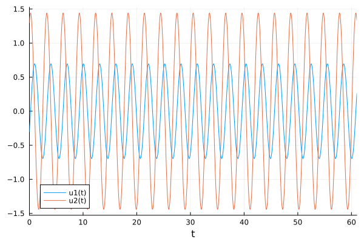{#fig:002 width=70%}

## Колебания гармонического осциллятора без затуханий и без действий внешней силы

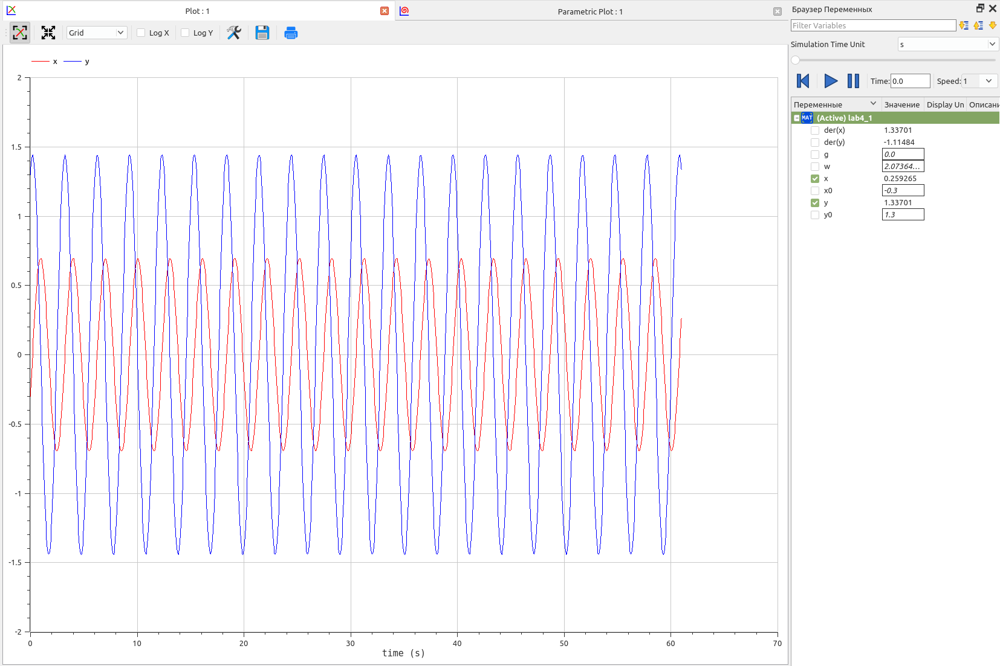{#fig:003 width=70%}

## Колебания гармонического осциллятора без затуханий и без действий внешней силы

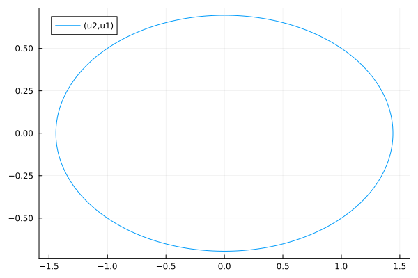{#fig:004 width=70%}

## Колебания гармонического осциллятора без затуханий и без действий внешней силы

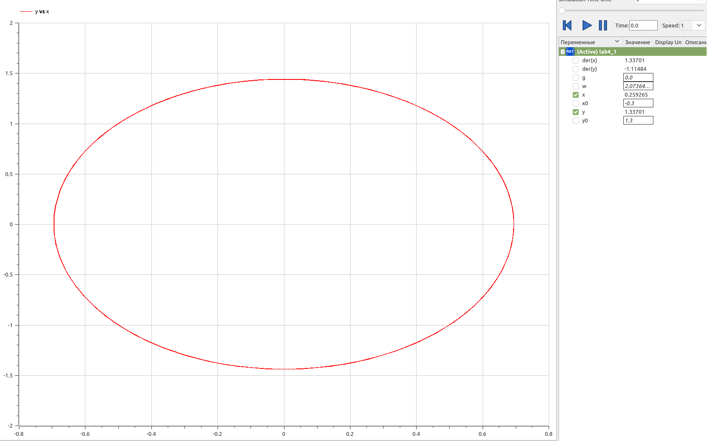{#fig:005 width=70%}

## Колебания гармонического осциллятора с затуханием и без действий внешней силы 

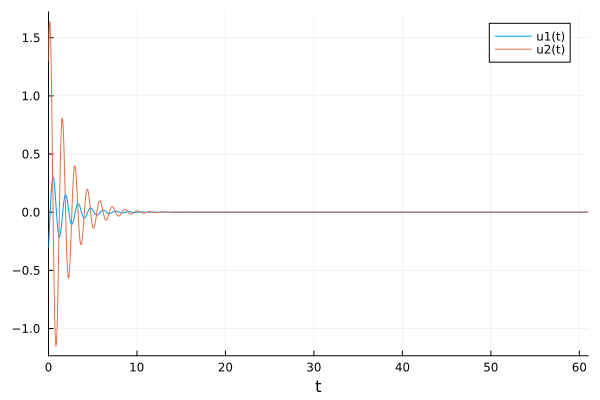{#fig:006 width=70%}

## Колебания гармонического осциллятора с затуханием и без действий внешней силы 

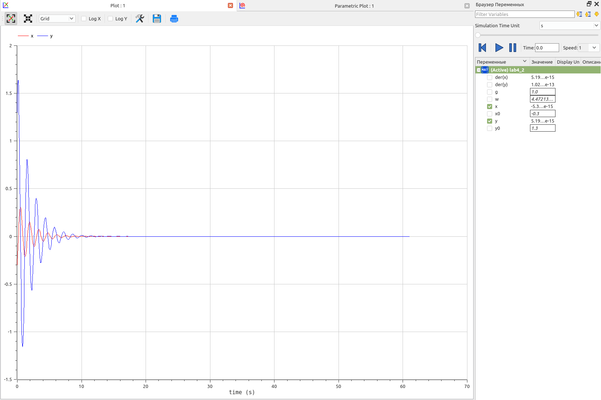{#fig:007 width=70%}

## Колебания гармонического осциллятора с затуханием и без действий внешней силы 

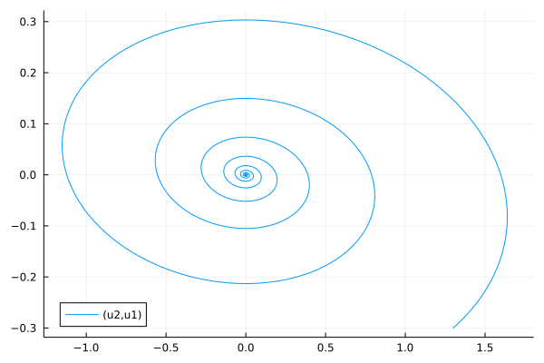{#fig:008 width=70%}

## Колебания гармонического осциллятора с затуханием и без действий внешней силы 

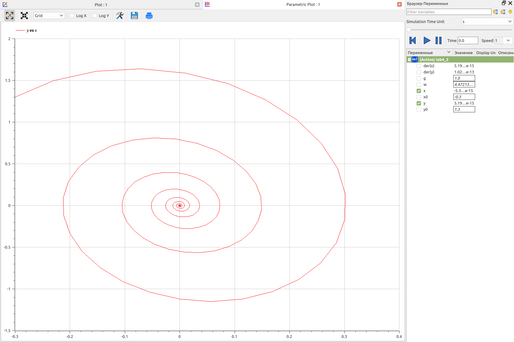{#fig:009 width=70%}

## Колебания гармонического осциллятора c затуханием и под действием внешней силы 

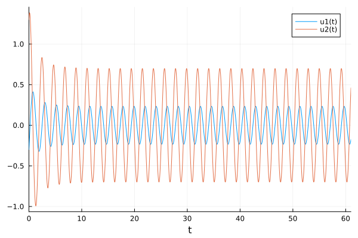{#fig:010 width=70%}

## Колебания гармонического осциллятора c затуханием и под действием внешней силы 

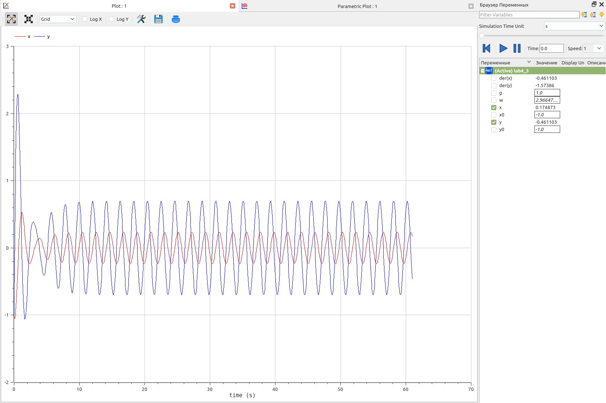{#fig:011 width=70%}

## Колебания гармонического осциллятора c затуханием и под действием внешней силы 

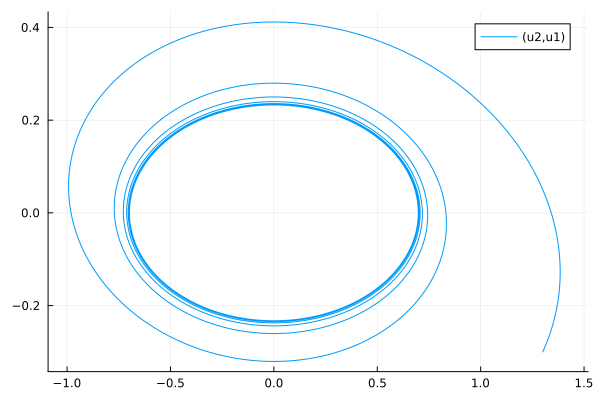{#fig:012 width=70%}

## Колебания гармонического осциллятора c затуханием и под действием внешней силы 

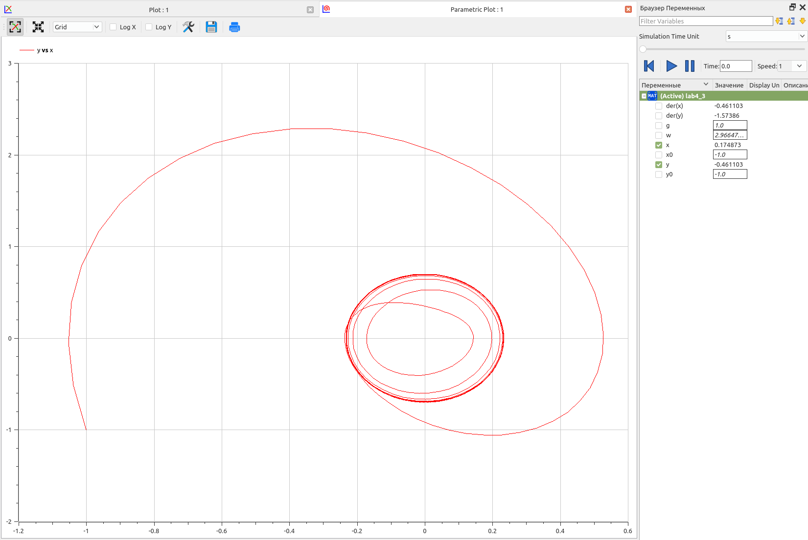{#fig:013 width=70%}


## Выводы

Построили математическую модель гармонического осциллятора и провели анализ.
