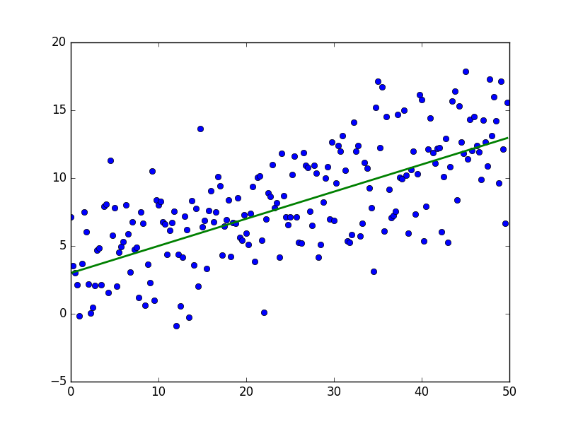
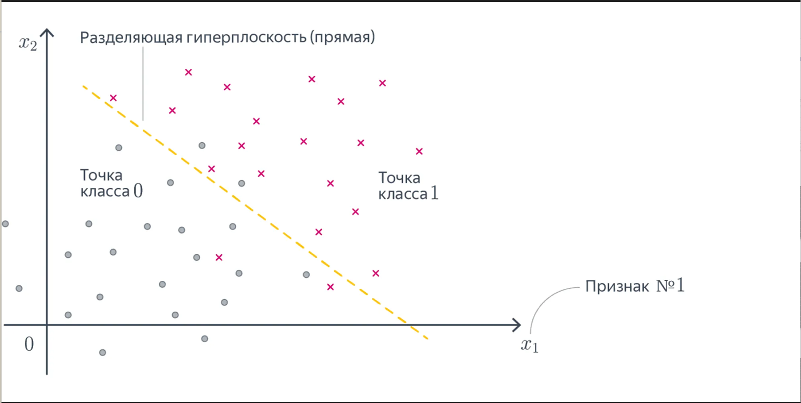
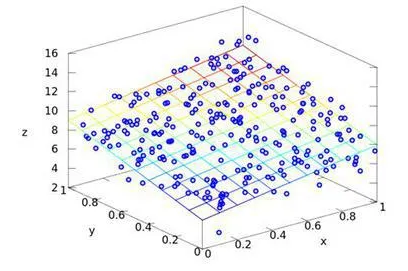
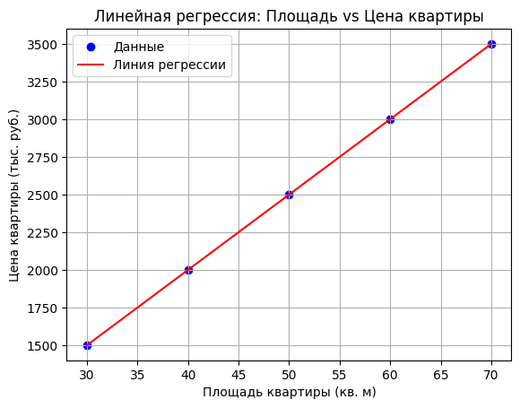

---
## Front matter
lang: ru-RU
title: Доклад
subtitle: "Линейные модели"
author:
  - Чемоданова Ангелина Александровна
teacher:
  - Кулябов Д. С.
  - д.ф.-м.н., профессор
  - профессор кафедры теории вероятностей и кибербезопасности 
institute:
  - Российский университет дружбы народов имени Патриса Лумумбы, Москва, Россия
date: 18 марта 2025

## i18n babel
babel-lang: russian
babel-otherlangs: english

## Formatting pdf
toc: false
toc-title: Содержание
slide_level: 2
aspectratio: 169
section-titles: true
theme: metropolis
header-includes:
 - \metroset{progressbar=frametitle,sectionpage=progressbar,numbering=fraction}
---

# Информация

## Докладчик

:::::::::::::: {.columns align=center}
::: {.column width="70%"}

  * Чемоданова Ангелина Александровна
  * Cтудентка НФИбд-02-22
  * Российский университет дружбы народов имени Патриса Лумумбы
  * [1132226443@pfur.ru](mailto:1132226443@pfur.ru)
  * <https://github.com/aachemodanova>

:::
::: {.column width="30%"}


:::
::::::::::::::

# Вводная часть

## Цели и задачи

**Цель**

Исследовать линейные модели.

**Задачи**

- Дать определение и описание линейных моделей.  

- Описать алгоритм построения линейных моделей и их применения.  

- Провести теоретический разбор примера использования линейной модели.  

- Продемонстрировать практическую реализацию линейной модели на языке программирования Python.

## Актуальность

- Простота и интерпретируемость

- Высокая вычислительная эффективность

- Работа с малыми объемы данных

## Определение

**Линейные модели** — это класс математических моделей, в которых зависимость между входными (независимыми) переменными и целевой (зависимой) переменной выражается через линейную функцию.

Линейная модель описывается следующим уравнением:

$$y = \beta_0 + \beta_1 x_1 + \beta_2 x_2 + \dots + \beta_p x_p + \epsilon$$


## Линейная регрессия

:::::::::::::: {.columns align=center}
::: {.column width="50%"}

Линейная регрессия используется для прогнозирования числовых значений на основе линейной зависимости от одного признака или нескольких признаков.

**Уравнение линейной регрессии**:

$y = \beta_0 + \beta_1 x_1 + \epsilon$

:::
::: {.column width="50%"}



:::
::::::::::::::

## Логистическая регрессия

:::::::::::::: {.columns align=center}
::: {.column width="40%"}

Логистическая регрессия используется для задач классификации, когда целевая переменная принимает два или более категориальных значений. .

**Уравнение логистической регрессии**:

$P(y=1 | x) = \frac{1}{1 + e^{-(\beta_0 + \beta_1 x_1)}}$

:::
::: {.column width="60%"}



:::
::::::::::::::

## Множественная линейная регрессия

:::::::::::::: {.columns align=center}
::: {.column width="50%"}

Множественная линейная регрессия является расширением простой линейной регрессии и используется для предсказания числовых значений, когда зависимость между целевой переменной и несколькими независимыми переменными.

**Уравнение множественной линейной регрессии**:

$y = \beta_0 + \beta_1 x_1 + \beta_2 x_2 + \dots + \beta_p x_p + \epsilon$

:::
::: {.column width="50%"}



:::
::::::::::::::

# Анализ качества модели

## Анализ качества модели. MSE

**Среднеквадратичная ошибка (MSE - Mean Squared Error)**

MSE вычисляется как среднее значение квадратов разностей между реальными и предсказанными значениями: 

   $$MSE = \frac{1}{n} \sum_{i=1}^{n} (y_i - \hat{y}_i)^2$$

## Анализ качества модели. MAE

 **Средняя абсолютная ошибка (MAE - Mean Absolute Error)** 

MAE — это среднее значение абсолютных разностей между фактическими и предсказанными значениями:  

   $$MAE = \frac{1}{n} \sum_{i=1}^{n} |y_i - \hat{y}_i|$$


# Пример работы линейной модели

## Расчет цены квартиры с помощью линейной регресии

У нас есть следующие данные:

| Площадь (кв. м) | Цена (тыс. руб.) |
|-----------------|------------------|
| 30              | 1,500            |
| 40              | 2,000            |
| 50              | 2,500            |
| 60              | 3,000            |
| 70              | 3,500            |

## Расчет цены квартиры с помощью линейной регресии

$$\text{Цена} = \beta_0 + \beta_1 \times \text{Площадь}$$

- $β_0 = 1,000$ 

- $β_1 = 50$ 

## Расчет цены квартиры с помощью линейной регресии

$$\text{Цена} = 1,000 + 50 \times \text{Площадь}$$

## Расчет цены квартиры с помощью линейной регресии

$$\text{Цена} = 1,000 + 50 \times 55 = 1,000 + 2,750 = 3,750 \text{ тыс. руб.}$$

# Практическая реализация

## Используемые библиотеки

```Python
import numpy as np
import matplotlib.pyplot as plt
from sklearn.linear_model import LinearRegression
```

## Данные для вычислений

```
# Данные: площадь квартиры (кв. м) и её цена (тыс. руб.)
X = np.array([30, 40, 50, 60, 70]).reshape(-1, 1) # Площадь квартиры (независимая переменная)
y = np.array([1500, 2000, 2500, 3000, 3500])  # Цена квартиры (зависимая переменная)
```

## Обучение модели на данных

```
# Инициализация модели линейной регрессии
model = LinearRegression()

# Обучение модели на данных
model.fit(X, y)
```

## Вывод коэффициентов

```
intercept = model.intercept_  # Свободный член (β₀)
coefficient = model.coef_[0]  # Коэффициент при X (β₁)

print(f"Свободный член (β₀): {intercept}")
print(f"Коэффициент (β₁): {coefficient}")
```

## Прогнозирование цены

```
# Прогнозирование цены для квартиры с площадью 55 кв. м
predicted_price = model.predict([[55]])

print(f"Прогнозируемая цена для квартиры площадью 55 кв. м: {predicted_price[0]} тыс. руб.")
```

## Визуализация данных

```
# Визуализация данных и линии регрессии
plt.scatter(X, y, color='blue', label='Данные')  # Исходные данные
plt.plot(X, model.predict(X), color='red', label='Линия регрессии')  # Линия регрессии
plt.xlabel('Площадь квартиры (кв. м)')
plt.ylabel('Цена квартиры (тыс. руб.)')
plt.title('Линейная регрессия: Площадь vs Цена квартиры')
plt.legend()
plt.grid(True)
plt.show()
```

## Вывод коэффициентов и прогнозируемой цены

```   
Свободный член (β₀): -4.547473508864641e-13
Коэффициент (β₁): 50.00000000000001
Прогнозируемая цена для квартиры площадью 55 кв. м: 2750.0 тыс. руб.
```

## Результат работы

{#fig:006 width=70%}

# Выводы
