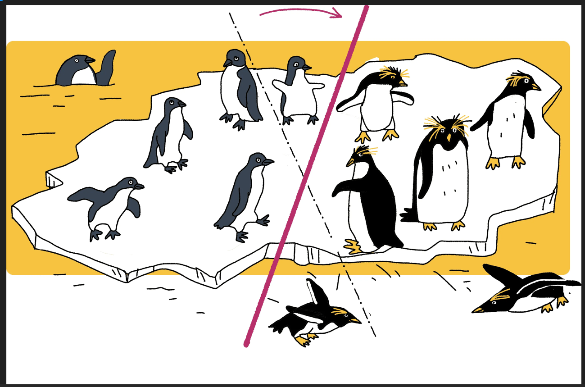
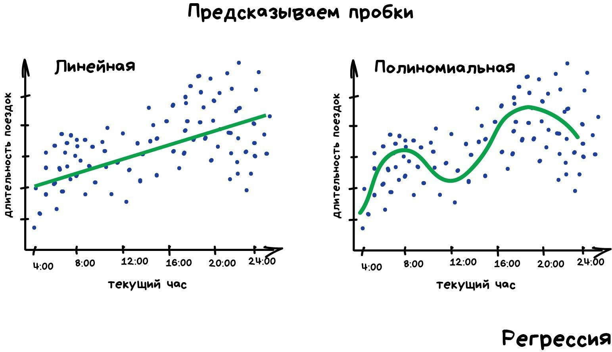
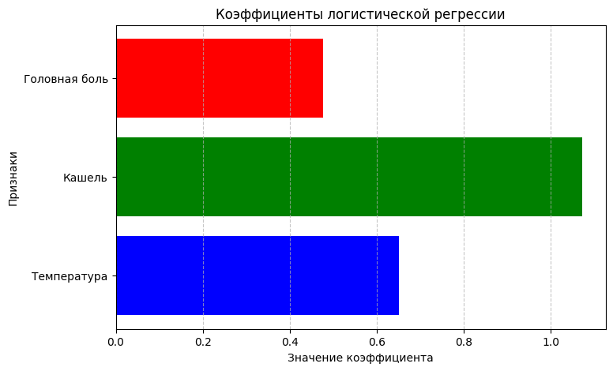

---
## Front matter
title: "Доклад"
subtitle: "Линейные модели"
author: "Чемоданова Ангелина Александровна"

## Generic otions
lang: ru-RU
toc-title: "Содержание"

## Bibliography
bibliography: bib/cite.bib
csl: pandoc/csl/gost-r-7-0-5-2008-numeric.csl

## Pdf output format
toc: true # Table of contents
toc-depth: 2
lof: true # List of figures
lot: true # List of tables
fontsize: 12pt
linestretch: 1.5
papersize: a4
documentclass: scrreprt
## I18n polyglossia
polyglossia-lang:
  name: russian
  options:
	- spelling=modern
	- babelshorthands=true
polyglossia-otherlangs:
  name: english
## I18n babel
babel-lang: russian
babel-otherlangs: english
## Fonts
mainfont: IBM Plex Serif
romanfont: IBM Plex Serif
sansfont: IBM Plex Sans
monofont: IBM Plex Mono
mathfont: STIX Two Math
mainfontoptions: Ligatures=Common,Ligatures=TeX,Scale=0.94
romanfontoptions: Ligatures=Common,Ligatures=TeX,Scale=0.94
sansfontoptions: Ligatures=Common,Ligatures=TeX,Scale=MatchLowercase,Scale=0.94
monofontoptions: Scale=MatchLowercase,Scale=0.94,FakeStretch=0.9
mathfontoptions:
## Biblatex
biblatex: true
biblio-style: "gost-numeric"
biblatexoptions:
  - parentracker=true
  - backend=biber
  - hyperref=auto
  - language=auto
  - autolang=other*
  - citestyle=gost-numeric
## Pandoc-crossref LaTeX customization
figureTitle: "Рис."
tableTitle: "Таблица"
listingTitle: "Листинг"
lofTitle: "Список иллюстраций"
lotTitle: "Список таблиц"
lolTitle: "Листинги"
## Misc options
indent: true
header-includes:
  - \usepackage{indentfirst}
  - \usepackage{float} # keep figures where there are in the text
  - \floatplacement{figure}{H} # keep figures where there are in the text
---

# Введение

**Цель**

Цель данной работы -- исследовать линейные модели.

**Задачи** 

- Дать определение и описание линейных моделей.  
- Рассмотреть основные виды линейных моделей, включая линейную, логистическую, множественную и полиномиальную регрессию.  
- Описать алгоритм построения линейных моделей и их применения.  
- Провести теоретический разбор примера использования линейной модели.  
- Продемонстрировать практическую реализацию линейной модели на языке программирования Python.

**Актуальность**

1. **Простота и интерпретируемость**: Линейные модели (например, линейная регрессия) являются одними из самых простых для понимания и объяснения. В то время как сложные модели, такие как нейронные сети, могут быть трудно интерпретируемыми, линейные модели предлагают четкое представление о том, как отдельные признаки влияют на целевую переменную.

2. **Высокая вычислительная эффективность**: Линейные модели требуют гораздо меньше вычислительных ресурсов по сравнению с более сложными методами машинного обучения, такими как случайный лес или нейронные сети. Это делает их идеальными для приложений, где скорость обработки данных и экономия ресурсов имеют критическое значение.

3. **Малые объемы данных**: Линейные модели часто работают хорошо при относительно малых объемах данных, что бывает полезно, когда сбор большого количества данных ограничен.

4. **Общее применение**: Линейные модели используются в широком спектре задач, таких как прогнозирование, анализ рисков, эконометрия, медицинские исследования и маркетинг, где важны зависимость между переменными и прогнозирование.

5. **Основа для более сложных моделей**: Линейные модели часто служат основой для более сложных методов. Например, многие методы машинного обучения, такие как регрессионный анализ, используют линейные модели в качестве базовых шагов, перед тем как переходить к более сложным подходам.

# Описание дерева решений

## Определения

**Линейные модели** — это класс математических моделей, в которых зависимость между входными (независимыми) переменными и целевой (зависимой) переменной выражается через линейную функцию. Такие модели предполагают, что воздействие каждого признака на результат является линейным и пропорциональным[@wiki_en].

### Формальное определение:
Линейная модель описывается следующим уравнением:

$y = \beta_0 + \beta_1 x_1 + \beta_2 x_2 + \dots + \beta_p x_p + \epsilon$

где:

- $y$ — зависимая переменная (результат),

- $x_1, x_2, \dots, x_p$ — независимые переменные (признаки или входные данные),

- $β_0$ — свободный член (переменная, отвечающая за смещение),

- $β_1, β_2, \dots, β_p$ — коэффициенты, которые определяют степень влияния соответствующих признаков на результат,

- $ε$ — случайная ошибка, которая отражает неопределенности или другие непредсказуемые факторы.

### Виды линейных моделей:

1. **Линейная регрессия**:
Это одна из самых известных линейных моделей, которая используется для прогнозирования количественных значений. В линейной регрессии предполагается, что существует линейная зависимость между целевой переменной y и набором входных признаков x_1, x_2, ..., x_p.
   
2. **Логистическая регрессия**:
Хотя называется регрессией, это модель классификации(рис. [-@fig:001]), а не регрессии. Логистическая регрессия используется для предсказания вероятностей (например, принадлежности объекта к определенному классу) и базируется на логистической функции, которая ограничивает выходные значения в интервале от 0 до 1.
   
3. **Множественная линейная регрессия**:
Это расширение линейной регрессии, когда на результат влияет более одного признака. В множественной линейной регрессии задача заключается в нахождении коэффициентов $β_1, β_2, \dots, β_p$, которые минимизируют разницу между предсказанным значением и истинным значением.

4. **Полиномиальная регрессия**:
Это вид линейной модели, в котором для каждого признака строится полиномиальная зависимость, т.е. используется более сложная функция, чем просто линейная. Например, $y = β_0 + β_1 x + β_2 x^2 + ε$. Несмотря на наличие степени переменных, это все равно линейная модель, потому что коэффициенты остаются линейными относительно параметров.

{#fig:001 width=70%}

# Задача построения линейных моделей

Задача построения линейной модели заключается в нахождении оптимальных коэффициентов (или параметров) модели, которые минимизируют ошибку предсказания. Основная цель — построить математическую модель, которая наилучшим образом описывает зависимость между целевой переменной и набором независимых переменных.

Для этого требуется:

1. Определить тип модели.

2. Собрать и подготовить данные (проверить на наличие пропусков, выбросов и аномальных значений).

3. Построить модель и оценить ее эффективность с помощью метрик, таких как среднеквадратическая ошибка (MSE), коэффициент детерминации (R^2) и другие.

4. Оценить значимость признаков и, при необходимости, выполнить регуляризацию.

## Общий алгоритм построения линейных моделей

1. **Сбор данных**:
   - Собрать данные, которые будут использоваться для построения модели.
   - Убедиться, что данные очищены и подготовлены (нет пропусков и выбросов).

2. **Выбор модели**:
   - Выбрать тип линейной модели в зависимости от задачи (например, линейная регрессия для прогнозирования числовых значений, логистическая регрессия для классификации и т.д.).

3. **Разделение данных**:
   - Разделить данные на обучающую и тестовую выборки для оценки качества модели.

4. **Обучение модели**:
   - Для линейной регрессии — найти параметры β, минимизируя ошибку (например, методом наименьших квадратов).
   - Для логистической регрессии — использовать метод максимального правдоподобия для нахождения коэффициентов.

5. **Оценка модели**:
   - Проверить точность модели на тестовых данных.
   - Использовать метрики: среднеквадратическую ошибку (MSE), коэффициент детерминации (R^2) и т.д.

6. **Настройка гиперпараметров**:
   - Если необходимо, провести регуляризацию для улучшения модели (например, с помощью Лассо или Риджа).

7. **Интерпретация результатов**:
   - Проанализировать коэффициенты модели и понять, как признаки влияют на результат.

## Линейная регрессия

Линейная регрессия[@wiki_glm] используется для прогнозирования числовых значений на основе линейной зависимости от одного признака (в случае простой линейной регрессии) или нескольких признаков (в случае множественной линейной регрессии)(рис. [-@fig:002]).

{#fig:002 width=70%}

**Уравнение линейной регрессии**:

$y = \beta_0 + \beta_1 x_1 + \epsilon$

где:

- $y$ — целевая переменная (что нужно предсказать),

- $x_1$ — независимая переменная (признак),

- $β_0$ — свободный член (смещение),

- $β_1$ — коэффициент, показывающий влияние признака $x_1$ на $y$,

- $ε$ — ошибка модели (случайное отклонение).

**Алгоритм**:

1. Определение зависимой и независимой переменной.

2. Использование метода наименьших квадратов для нахождения коэффициентов $β_0$ и $β_1$.

3. Прогнозирование значений для новых данных.

## Логистическая регрессия

Логистическая регрессия[@scikit_en] используется для задач классификации, когда целевая переменная принимает два или более категориальных значений. Она моделирует вероятность того, что объект принадлежит определенному классу (рис. [-@fig:003]).

{#fig:003 width=70%}

**Уравнение логистической регрессии**:

$P(y=1 | x) = \frac{1}{1 + e^{-(\beta_0 + \beta_1 x_1)}}$

где:

- $P(y=1 | x)$ — вероятность того, что объект принадлежит классу 1,

- $β_0, β_1$ — параметры модели,

- $x_1$ — независимая переменная.

Логистическая регрессия использует **сигмоидную функцию** для преобразования линейной комбинации признаков в вероятность.

**Алгоритм**:

1. Определение целевой переменной (классы).

2. Применение логистической функции для получения вероятности.

3. Определение коэффициентов $β_0, β_1$ с помощью метода максимального правдоподобия.

4. Прогнозирование классов на основе порога вероятности (обычно 0.5).

## Множественная линейная регрессия

Множественная линейная[@wiki_lr] регрессия является расширением простой линейной регрессии и используется для предсказания числовых значений, когда зависимость между целевой переменной и несколькими независимыми переменными (рис. [-@fig:004]).

{#fig:004 width=70%}

**Уравнение множественной линейной регрессии**:

$y = \beta_0 + \beta_1 x_1 + \beta_2 x_2 + \dots + \beta_p x_p + \epsilon$

где:

- $y$ — целевая переменная,

- $x_1, x_2, \dots, x_p$ — независимые переменные,

- $β_0, β_1, \dots, β_p$ — коэффициенты,

- $ε$ — ошибка.

**Алгоритм**:

1. Разделить данные на признаки $x_1, x_2, \dots, x_p$ и целевую переменную $y$.

2. Использовать метод наименьших квадратов для нахождения оптимальных коэффициентов.

3. Прогнозировать значения для новых данных.

## Полиномиальная регрессия

Полиномиальная регрессия[@wiki_lr] используется, когда зависимость между переменными не является линейной, но может быть аппроксимирована полиномом. Это расширение линейной регрессии, где признаки $x$ возводятся в степени (рис. [-@fig:005]).

{#fig:005 width=70%}

**Уравнение полиномиальной регрессии (2-й степени)**:

$y = \beta_0 + \beta_1 x + \beta_2 x^2 + \epsilon$

**Алгоритм**:

1. Преобразовать данные, добавив степени признаков (например, $x^2, x^3$).

2. Применить линейную регрессию для получения коэффициентов.

3. Прогнозировать значения для новых данных.

Полиномиальная регрессия позволяет моделировать более сложные зависимости, чем линейная, и полезна, когда между признаками и целевой переменной существует нелинейная связь.

# **Анализ качества модели**

При оценке линейных моделей важно не только обучить модель, но и понять, насколько хорошо она предсказывает данные. Для этого используются различные метрики качества, такие как среднеквадратичная ошибка (MSE), средняя абсолютная ошибка (MAE) и коэффициент детерминации (R²).

## Метрики оценки качества линейной модели
1. **Среднеквадратичная ошибка (MSE - Mean Squared Error)**  

MSE вычисляется как среднее значение квадратов разностей между реальными и предсказанными значениями: 

   $$MSE = \frac{1}{n} \sum_{i=1}^{n} (y_i - \hat{y}_i)^2$$

Чем меньше значение MSE, тем лучше модель предсказывает данные. Однако, из-за возведения в квадрат MSE чувствителен к выбросам[@scikit_ru].

2. **Средняя абсолютная ошибка (MAE - Mean Absolute Error)** 

MAE — это среднее значение абсолютных разностей между фактическими и предсказанными значениями:  

   $$MAE = \frac{1}{n} \sum_{i=1}^{n} |y_i - \hat{y}_i|$$

В отличие от MSE, MAE менее чувствителен к выбросам, поскольку не использует квадраты ошибок[@yandex].

3. **Коэффициент детерминации (R²)**  

R² показывает, какая доля дисперсии зависимой переменной объясняется моделью: 

   $$R^2 = 1 - \frac{\sum (y_i - \hat{y}_i)^2}{\sum (y_i - \bar{y})^2}$$

Где $\bar{y}$ — среднее значение зависимой переменной. Значение R² варьируется от 0 до 1 (иногда может быть отрицательным при плохой модели). Чем ближе R² к 1, тем лучше модель объясняет данные[@scikit_en].

## Регуляризация линейных моделей
Обычная линейная регрессия может переобучаться на сложных данных. Чтобы уменьшить переобучение, используют регуляризованные версии модели — **Lasso** и **Ridge**.

1. **Ridge-регрессия (Гребневая регрессия)**  

Добавляет к функции потерь штраф за большие коэффициенты: 

   $$ \sum_{i=1}^{n} (y_i - \hat{y}_i)^2 + \lambda \sum_{j=1}^{p} \beta_j^2$$

Где $\lambda$ — коэффициент регуляризации. Ridge снижает влияние менее значимых признаков, но не зануляет их[@scikit_ru].

2. **Lasso-регрессия (Least Absolute Shrinkage and Selection Operator)**  

В отличие от Ridge, Lasso использует **L1-регуляризацию**, что приводит к обнулению коэффициентов некоторых признаков:

   $$\sum_{i=1}^{n} (y_i - \hat{y}_i)^2 + \lambda \sum_{j=1}^{p} |\beta_j|$$

Это делает Lasso полезной для отбора признаков, так как модель автоматически исключает менее значимые параметры[@scikit_ru].

# Пример работы алгоритма

## Теоретический пример: Расчет цены квартиры с помощью линейной регресии

Мы хотим узнать, сколько будет стоить квартира в зависимости от её площади. Допустим, мы уже знаем цены на несколько квартир и их площади. Мы можем использовать линейную регрессию, чтобы построить модель и предсказать цену квартиры, если мы знаем её площадь.

**1. Задача**

У нас есть следующие данные:

: Данные отношения цены и площади квартиры {#tbl:entr}

| Площадь (кв. м) | Цена (тыс. руб.) |
|-----------------|------------------|
| 30              | 1,500            |
| 40              | 2,000            |
| 50              | 2,500            |
| 60              | 3,000            |
| 70              | 3,500            |

Эти данные показывают, что с увеличением площади квартиры, её цена растет. Теперь наша задача — использовать эти данные, чтобы предсказать цену квартиры, если её площадь, например, 55 кв. м.

**2. Как работает линейная регрессия?**

Линейная регрессия пытается найти прямую линию, которая наилучшим образом описывает зависимость между двумя переменными. В нашем случае переменные — это площадь квартиры и её цена. Линия будет выглядеть так:

$\text{Цена} = \beta_0 + \beta_1 \times \text{Площадь}$

Здесь:

- $β_0$ — это свободный член (когда площадь = 0, цена = $β_0$).

- $β_1$ — это коэффициент, который показывает, как изменяется цена при увеличении площади на 1 кв. м.

**3. Как найти $β_0$ и $β_1$?**

Линейная регрессия находит такие значения для $β_0$ и $β_1$, которые минимизируют ошибку между реальными ценами и предсказанными ценами для каждой квартиры. Это делается с помощью метода наименьших квадратов, который находит «наилучшую» прямую.

Но давайте для простоты представим, что мы уже нашли такие значения, и они составляют:

- $β_0 = 1,000$ (если площадь = 0, то цена квартиры будет 1,000 тыс. руб.)

- $β_1 = 50$ (за каждый дополнительный квадратный метр площадь квартиры будет увеличиваться на 50 тыс. руб.)

Тогда наша модель будет выглядеть так:

$\text{Цена} = 1,000 + 50 \times \text{Площадь}$

**4. Как использовать модель для предсказания?**

Теперь, если площадь квартиры составляет 55 кв. м, мы можем использовать нашу модель для предсказания цены:

$\text{Цена} = 1,000 + 50 \times 55 = 1,000 + 2,750 = 3,750 \text{ тыс. руб.}$

Значит, цена квартиры площадью 55 кв. м будет **3,750 тысяч рублей**.

**5. Как выглядит эта линия?**

Если мы построим график, где по оси X будет площадь квартиры, а по оси Y — цена, то линия будет выглядеть так:

- Если площадь квартиры = 0, то цена будет равна 1,000.
- Когда площадь увеличивается, цена будет увеличиваться на 50 тысяч рублей за каждый квадратный метр.

## Теоретический пример: Предсказание болен человек или нет по симптомам с помощью логистической регрессии

Рассмотрим задачу бинарной классификации: необходимо предсказать, болен ли пациент $( y = 1 )$ или здоров $( y = 0 )$ на основе его симптомов.  

**Постановка задачи**

Допустим, у нас есть набор данных о пациентах, содержащий несколько признаков (симптомов):  

- $x_1$ – температура тела,  

- $x_2$ – наличие кашля (1 – есть, 0 – нет),

- $x_3$ – боль в горле (1 – есть, 0 – нет).  

Целевая переменная $y$ принимает два значения:  

- $y = 1$ (пациент болен),  

- $y = 0$ (пациент здоров).  

**Модель логистической регрессии**
Логистическая регрессия предсказывает вероятность того, что пациент болен, используя сигмоидную функцию:  

$P(y=1 | x) = \frac{1}{1 + e^{-(w_0 + w_1x_1 + w_2x_2 + w_3x_3)}}$

Где:  
- $w_0$ – свободный член,  
- $w_1, w_2, w_3$ – коэффициенты модели, которые определяют вклад каждого симптома.  

**Интерпретация коэффициентов**

- Если $w_1 > 0$, то повышение температуры увеличивает вероятность заболевания.  
- Если $w_2 > 0$, то наличие кашля также повышает вероятность болезни.  
- Если $w_3 > 0$, то боль в горле увеличивает вероятность заболевания.  

**Принятие решения**  
После вычисления вероятности заболевания $( P(y=1 | x) )$, принимаем решение:  
- Если вероятность больше 0.5, считаем, что пациент болен $( y=1 )$.  
- Иначе считаем, что пациент здоров $( y=0 )$.  

$$
\hat{y} =
\begin{cases} 
1, \quad P(y=1 | x) \geq 0.5 \\
0, \quad P(y=1 | x) < 0.5
\end{cases}
$$

**Заключение**  
Логистическая регрессия позволяет интерпретировать влияние каждого симптома на вероятность заболевания. Кроме того, можно использовать коэффициенты модели для определения наиболее значимых факторов, влияющих на болезнь.


# Практическая реализация

Для реализации использован язык Python и несколько популярных библиотек для выполнения задач машинного обучения и визуализации данных. В частности, для реализации моделей используется библиотека scikit-learn, а для визуализации данных — библиотека matplotlib.

Основная цель — построить модель линейной регрессии, которая будет предсказывать цену квартиры на основе её площади, и модель логистической регрессии, которая будет предсказывать болен человек или нет по симптомам. 

## Расчет цены квартиры с помощью линейной регресии

```Python
import numpy as np
import matplotlib.pyplot as plt
from sklearn.linear_model import LinearRegression

# Данные: площадь квартиры (кв. м) и её цена (тыс. руб.)
X = np.array([30, 40, 50, 60, 70]).reshape(-1, 1)  # Площадь квартиры (независимая переменная)
y = np.array([1500, 2000, 2500, 3000, 3500])      # Цена квартиры (зависимая переменная)

# Инициализация модели линейной регрессии
model = LinearRegression()

# Обучение модели на данных
model.fit(X, y)

# Получение коэффициентов модели
intercept = model.intercept_  # Свободный член (B₀)
coefficient = model.coef_[0]  # Коэффициент при X (B₁)

print(f"Свободный член (B₀): {intercept}")
print(f"Коэффициент (B₁): {coefficient}")

# Прогнозирование цены для квартиры с площадью 55 кв. м
predicted_price = model.predict([[55]])

print(f"Прогнозируемая цена для квартиры площадью 55 кв. м: {predicted_price[0]} тыс. руб.")

# Визуализация данных и линии регрессии
plt.scatter(X, y, color='blue', label='Данные')  # Исходные данные
plt.plot(X, model.predict(X), color='red', label='Линия регрессии')  # Линия регрессии
plt.xlabel('Площадь квартиры (кв. м)')
plt.ylabel('Цена квартиры (тыс. руб.)')
plt.title('Линейная регрессия: Площадь vs Цена квартиры')
plt.legend()
plt.grid(True)
plt.show()
```

В результате получим(рис. [-@fig:006]):
```
Свободный член (B₀): -4.547473508864641e-13
Коэффициент (B₁): 50.00000000000001
Прогнозируемая цена для квартиры площадью 55 кв. м: 2750.0 тыс. руб.
```

{#fig:006 width=70%}

## Предсказание болен человек или нет по симптомам с помощью логистической регрессии

```Python
import numpy as np
import pandas as pd
import matplotlib.pyplot as plt
from sklearn.model_selection import train_test_split
from sklearn.preprocessing import StandardScaler
from sklearn.linear_model import LogisticRegression
from sklearn.metrics import mean_squared_error, mean_absolute_error, r2_score

# Создадим искусственный набор данных
data = {
    "Температура": [37.5, 38.2, 36.8, 39.0, 37.1, 38.5, 36.6, 37.8, 39.2, 36.7],
    "Кашель": [1, 1, 0, 1, 0, 1, 0, 1, 1, 0],
    "Головная боль": [0, 1, 0, 1, 0, 1, 0, 1, 1, 0],
    "Болен": [1, 1, 0, 1, 0, 1, 0, 1, 1, 0]  # 1 - болен, 0 - здоров
}

df = pd.DataFrame(data)

# Разделяем на признаки (X) и целевую переменную (y)
X = df.drop(columns=["Болен"])
y = df["Болен"]

# Разделяем на обучающую и тестовую выборки
X_train, X_test, y_train, y_test = train_test_split(X, y, test_size=0.2, random_state=42)

# Масштабируем признаки
scaler = StandardScaler()
X_train = scaler.fit_transform(X_train)
X_test = scaler.transform(X_test)

# Создаем и обучаем модель
model = LogisticRegression()
model.fit(X_train, y_train)

# Предсказание на тестовой выборке
y_pred = model.predict(X_test)
y_prob = model.predict_proba(X_test)[:, 1]  # вероятности для класса 1


# MSE, MAE, R²
mse = mean_squared_error(y_test, y_prob)
mae = mean_absolute_error(y_test, y_prob)
r2 = r2_score(y_test, y_prob)

print("MSE (Mean Squared Error):", mse)
print("MAE (Mean Absolute Error):", mae)
print("R² (Coefficient of Determination):", r2)

# Вывод коэффициентов модели
feature_names = X.columns
coefficients = model.coef_[0]

print("\nКоэффициенты модели:")
for feature, coef in zip(feature_names, coefficients):
    print(f"{feature}: {coef:.4f}")

# Визуализация коэффициентов
plt.figure(figsize=(8, 5))
plt.barh(feature_names, coefficients, color=['blue', 'green', 'red'])
plt.xlabel("Значение коэффициента")
plt.ylabel("Признаки")
plt.title("Коэффициенты логистической регрессии")
plt.grid(axis='x', linestyle='--', alpha=0.7)
plt.show()
```

Результат(рис. [-@fig:007]):

```
MSE (Mean Squared Error): 0.004548739533804984
MAE (Mean Absolute Error): 0.06356650670144237
R² (Coefficient of Determination): 0.0

Коэффициенты модели:
Температура: 0.6510
Кашель: 1.0724
Головная боль: 0.4773
```
{#fig:007 width=70%}

# Выводы 

В ходе данной работы были рассмотрены линейные модели и их применение в задачах прогнозирования. Мы изучили основные виды линейных моделей.  

Было показано, что линейные модели обладают высокой интерпретируемостью, простотой реализации и вычислительной эффективностью. Они находят широкое применение в различных сферах, таких как экономика, медицина, маркетинг и прогнозирование.  

Практическая часть включала реализацию линейной регрессии на языке Python с использованием библиотеки `sklearn`. В результате построенная модель позволила предсказать цену квартиры в зависимости от её площади, продемонстрировав применимость линейных моделей к реальным задачам.  

Таким образом, данная работа продемонстрировала, что линейные модели являются мощным инструментом для анализа данных, и их понимание является важным шагом в изучении методов машинного обучения.

# Список литературы{.unnumbered}

::: {#refs}
:::
